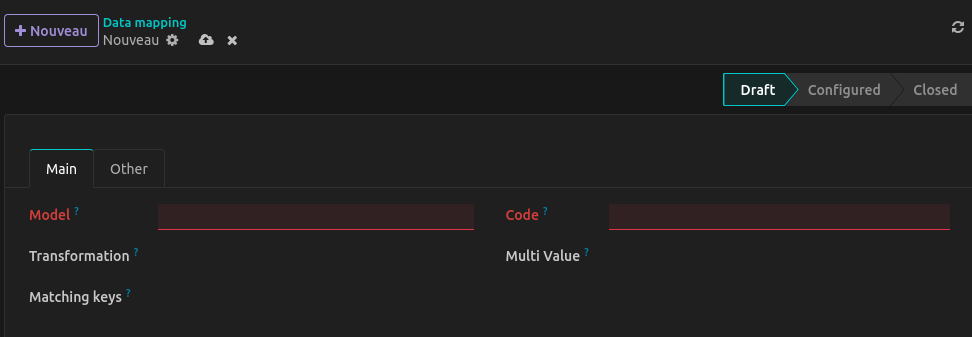
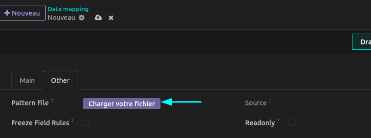

```python

class DataMap(models.Model):
    _inherit = "data.map"

    # Required code to set transformation scenario
    transformation = fields.Selection(selection_add=[("transformation1", "Flow 1")])

    # Optional code to apply custom changes
    def _df_alter_transformation1(self, df):
        """This method is autmatically called because of transformation1 in method name"""
        # add column domain
        df = df.with_columns(domain=pl.lit("sale"))
        return df

```
